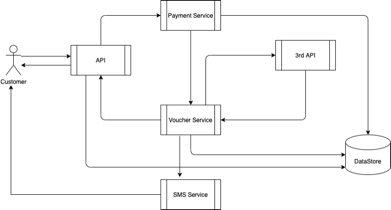
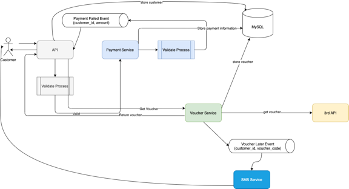

# ABC Banking Project

### Introduction

Bank ABC want to provide a new feature on its website. The feature is to purchase prepaid data for a SIM card by getting
a voucher code from a 3rd party. Anyone can purchase the prepaid data on the website without login.

### Requirement

- The bank wants to build a new service(s) to integrate with that 3rd party. But it expects that the API will return
  voucher code or a message that says the request is being processed within 30 seconds.
- If the web application receives the voucher code, it will show on the website for customers to use. In case that the
  code can't be returned in-time, the customer can receive it via SMS later.
- The customer can check all the voucher codes that they have purchased by phone number on the website, but it needs to
  be secured.
- Assume that the payment has been done before the website call to the services to get the voucher code.

### High level design

The basic algorithm executed by new service is to take information of amount payment of customer: phone number, amount
as its input and execute the following steps:

1. Validation customer information
2. Process payment with customer information
3. If process payment success will get voucher code.
4. If process payment failed after try 3 times, system will write to Database to tracking
5. Processing to get voucher code from 3rd API
6. If get voucher code from 3rd API is success , system will return for customer using
7. If get voucher code from 3rd API failed after try 3 times, system will write to database and send voucher code
   through SMS after.

So, base on above steps, we need minimize these components :

* API: Endpoint to call from website
* Payment: To store payment information
* Voucher: To store information from 3rd API
* Datastore: Store information as voucher, customer, payment



### Component Detail



### Database Schema

~~~sql
CREATE TABLE `passcode` (
  `pass_code` varchar(6) NOT NULL,
  `phone_number` varchar(20) NOT NULL,
  `created_date` datetime DEFAULT NULL,
  `status` int DEFAULT NULL,
  `updated_date` datetime DEFAULT NULL,
  `status_code` int NOT NULL,
  PRIMARY KEY (`pass_code`,`phone_number`),
  KEY `idx_phone_number` (`phone_number`),
  KEY `idx_pass_code` (`pass_code`)
) ENGINE=MyISAM DEFAULT CHARSET=utf8mb4 COLLATE=utf8mb4_0900_ai_ci;

CREATE TABLE `prepaid` (
  `id` binary(255) NOT NULL,
  `amount` double NOT NULL,
  `created_date` datetime DEFAULT NULL,
  `customer_id` binary(255) DEFAULT NULL,
  `updated_date` datetime DEFAULT NULL,
  PRIMARY KEY (`id`)
) ENGINE=MyISAM DEFAULT CHARSET=utf8mb4 COLLATE=utf8mb4_0900_ai_ci;

CREATE TABLE `voucher` (
  `id` binary(255) NOT NULL,
  `code` varchar(50) DEFAULT NULL,
  `created_date` datetime DEFAULT NULL,
  `phone_number` varchar(20) DEFAULT NULL,
  `status` int DEFAULT NULL,
  `status_code` int NOT NULL,
  `transaction_id` binary(255) DEFAULT NULL,
  `updated_date` datetime DEFAULT NULL,
  PRIMARY KEY (`id`),
  KEY `idx_code` (`code`),
  KEY `idx_phone_number` (`phone_number`),
  KEY `idx_transaction_id` (`transaction_id`)
) ENGINE=MyISAM DEFAULT CHARSET=utf8mb4 COLLATE=utf8mb4_0900_ai_ci;


CREATE TABLE `payment` (
  `id` binary(255) NOT NULL,
  `amount` double NOT NULL,
  `created_date` datetime DEFAULT NULL,
  `phone_number` varchar(255) DEFAULT NULL,
  `updated_date` datetime DEFAULT NULL,
  PRIMARY KEY (`id`)
) ENGINE=MyISAM DEFAULT CHARSET=utf8mb4 COLLATE=utf8mb4_0900_ai_ci;
~~~

### Folder structure

This project is structure by each module, and we have some module in this project

* api
    - This is module contain endpoint to access application and store passcode to access get info of vouchers

* eureka-server:
    - This is module contain discovery server to management communication each service

* external-api:
    - This is module contain stub 3rd API

* payment:
    - This is module contain payment info when user prepaid

* proto:
    - This is module contain proto file library

* sms:
    - This is module stub sms service

* voucher:
    - This is module contains voucher info when get from 3rd API

Each module have structure folder as below:

* src/
    * main/
        * java/vn/co/abc/banking/<module_name>:
            * config: Contain config classes of spring boot application
            * controller: Contain controller class to access server
                * request: Contain all request using in controller
                * response: Contain all response will return in controller
            * entity: Contain entity object of application
            * repository: Contain interface repository working with Database
            * exception: Contain custom exception using in application
            * message: Contain messages using send to Message Queue (ex Kafka)
            * service: Contain service process business logic of application
        * resources: contains all yaml file config for application

Technical is used in project:

    * JDK 11
    * Spring boot 2.4.1
    * Kafka
    * MySQL
    * Eureka Server
    * GRPC

### How to run it at localhost

1. Setup kafka in your localhost by this guide:

   https://kafka.apache.org/quickstart

2. Install mysql in your local machine

   https://dev.mysql.com/doc/mysql-installation-excerpt/5.7/en/

3. Access to mysql terminal by command

```shell
mysql -u <mysql_user> -p
```

you enter password of mysql user to config when install

4. Create database by command

```shell
CREATE DATABASE <database_name>;
```

After you create a database with name you want, go to application.yaml file of each service in source code replace
database connection info with database name you just create and username and password you config.

5.Go to root folder, run command

Window

```shell
mvnw install package -DskipTests
```

Linux/Unix

```shell
./mvnw install package -DskipTests
```

6. Run eurekaservice -> api -> external-api -> payment -> sms -> voucher

7. Run these command to test service working by curl

Prepaid action

```shell
curl --location --request POST 'http://<your_ip>/v1/prepaid' \
--header 'Content-Type: application/json' \
--data-raw '{
    "phoneNumber": "0123456789",
    "amount": 400
}'
```

Get passcode to view list voucher by phone number

```shell
curl --location --request POST 'http://<your_ip>/v1/passcode' \
--header 'Content-Type: application/json' \
--data-raw '{
    "phoneNumber": "0123456789"
}'
```

Get list vouchers by phone number prepaid

```shell
curl --location --request POST 'http://<your_ip>/v1/vouchers' \
--header 'Content-Type: application/json' \
--data-raw '{
    "phoneNumber": "0123456789",
    "passCode": "<passcode>"
}'
```

Note: You will replace <passcode> with response passcode of above step

### How to run it at docker

First you need install Docker daemon, Docker compose and SET bash to run from terminal:

* https://docs.docker.com/compose/install/

Git clone to your local machine

```git
git clone https://github.com/longvhdeveloper/NAB-Assignment.git
```

Build and docker all images

```shell
cd NAB-Assignment
```

Window

```shell
mvnw clean package -DskipTests
```

Linux/Unix

```shell
./mvnw clean package -DskipTests
```

Run docker-compose

```shell
docker-compose up --build
```

It will take some minutes to download dependencies and build image, after build successfuly, you need to run 2 below
commands. It also take some minutes to bring up springboot app

To see data in mysql database : run below command interminal

```shell
mysql -h localhost -P 3306 --protocol=tcp -u <mysql_user> -p <mysql_password>
```

Run these command to test service working by curl

Prepaid action

```shell
curl --location --request POST 'http://<your_ip>/v1/prepaid' \
--header 'Content-Type: application/json' \
--data-raw '{
    "phoneNumber": "0123456789",
    "amount": 400
}'
```

Get passcode to view list voucher by phone number

```shell
curl --location --request POST 'http://<your_ip>/v1/passcode' \
--header 'Content-Type: application/json' \
--data-raw '{
    "phoneNumber": "0123456789"
}'
```

Get list vouchers by phone number prepaid

```shell
curl --location --request POST 'http://<your_ip>/v1/vouchers' \
--header 'Content-Type: application/json' \
--data-raw '{
    "phoneNumber": "0123456789",
    "passCode": "<passcode>"
}'
```

Note: You will replace <passcode> with response passcode of above step

### Continue

- [ ] Write more unit test
- [ ] Implement case when can not get voucher from 3rd API afer retry
- [ ] Seperate passcode to service
- [ ] Limit time to get passcode and view voucher
- [ ] Implement exception handler to handle format error response
- [ ] Limit rate for request get passcode
- [ ] Refactoring and optimize code

### References

Folder "images" contains images of README.md.
